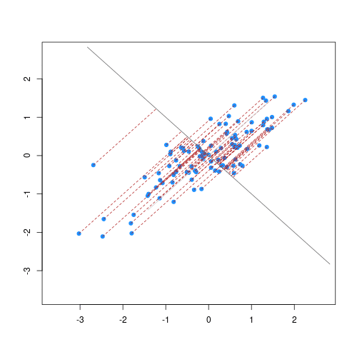

# Modul 1 — Unsupervised Learning
## Daftar Isi
- [Definisi](#definisi)
- [Tipe-tipe Unsupervised Learning](#tipe-tipe-unsupervised-learning)
  - [Clustering](#clustering)
    - [Konsep Dasar Clustering](#konsep-dasar-clustering)
    - [Prasyarat: Perhitungan Jarak](#prasyarat-perhitungan-jarak)
    - [Algoritma Clustering](#algoritma-clustering)
  - [Dimensionality Reduction](#dimensionality-reduction)
- [Principal Component Analysis](#principal-component-analysis)

 

# Definisi

 

**Unsupervised Learning** adalah metode dalam *Machine Learning* yang menggunakan **data tanpa label** untuk melatih algoritma.

Pada metode ini, model tidak diberikan informasi mengenai jawaban yang benar atau target. Model harus **mencari dan mempelajari pola, struktur, atau hubungan dalam data secara mandiri**.

Metode ini sering digunakan untuk:

- eksplorasi data
- menemukan pola tersembunyi
- pengelompokan data
- analisis struktur dataset

 

# Tipe-tipe Unsupervised Learning

# Clustering

Clustering adalah teknik untuk **mengelompokkan data berdasarkan kemiripan karakteristiknya**.

Data yang memiliki karakteristik mirip akan ditempatkan dalam satu kelompok yang disebut **cluster**, sedangkan data yang berbeda akan ditempatkan pada cluster yang berbeda.

 

Contoh penggunaan clustering:

- segmentasi pelanggan
- pengelompokan dokumen
- analisis perilaku pengguna

## Konsep Dasar Clustering

Tujuan utama dari clustering adalah:

- **Meminimalkan Intra-cluster Distance**  
  (jarak antar data di dalam cluster yang sama)

- **Memaksimalkan Inter-cluster Distance**  
  (jarak antara satu cluster dengan cluster lainnya)

 

 

Cluster yang baik memiliki:

- jarak antar data dalam cluster kecil
- jarak antar cluster besar

## Prasyarat: Perhitungan Jarak

Karena clustering mengelompokkan data berdasarkan **kedekatan jarak**, kita perlu mengetahui cara menghitung jarak antar data.

Beberapa metode perhitungan jarak yang umum digunakan:

1. **Manhattan Distance**
2. **Euclidean Distance**
3. **Minkowski Distance**

 

## Algoritma Clustering

Beberapa algoritma clustering yang sering digunakan dalam *Machine Learning* antara lain:

- [K-Means Clustering](./K-Means.md)
- [Hierarchical Clustering](./Hierarchical.md)
- [DBSCAN](./DBSCAN.md)

Setiap algoritma memiliki pendekatan yang berbeda dalam membentuk cluster, misalnya berbasis centroid, hierarki, atau kepadatan data.

 

# Dimensionality Reduction

Dimensionality Reduction adalah teknik untuk **mengurangi jumlah fitur atau variabel dalam dataset** tanpa menghilangkan informasi penting.

Tujuannya antara lain:

- mengurangi kompleksitas data
- mempercepat komputasi
- mempermudah visualisasi data

 

## Principal Component Analysis

**Principal Component Analysis (PCA)** adalah metode *dimensionality reduction* yang mentransformasikan data ke ruang dimensi baru dengan jumlah fitur yang lebih sedikit.

PCA bekerja dengan cara:

1. Menghitung variansi pada setiap fitur
2. Menentukan arah dengan variansi terbesar
3. Membentuk **principal components**
4. Mereduksi dimensi dataset berdasarkan komponen utama tersebut

Metode ini sering digunakan untuk:

- visualisasi data multidimensi
- kompresi data
- preprocessing sebelum training model machine learning

