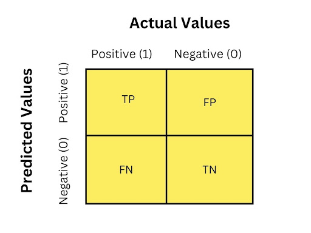

# Modul 2: Supervised Learning - Classification

## Daftar Isi
- [Modul 2: Supervised Learning - Classification](#modul-2-supervised-learning---classification)
  - [Daftar Isi](#daftar-isi)
  - [Pengenalan](#pengenalan)
  - [Klasifikasi](#klasifikasi)
  - [Metrik Klasifikasi](#metrik-klasifikasi)
  - [Machine Learning Techniques (Bonus)](#machine-learning-techniques-bonus)
    - [Cross-Validation (CV)](#cross-validation-cv)
      - [K-Fold](#k-fold)
      - [Stratified K-Fold](#stratified-k-fold)
    - [Hyperparameter Tuning](#hyperparameter-tuning)


## Pengenalan
Supervised learning adalah paradigma dalam pembelajaran mesin yang menggunakan data berlabel untuk melatih algoritma matematis. Tujuannya adalah agar algoritma mempelajari hubungan antara input (fitur) dengan output (target) sehingga dapat secara akurat memprediksi output untuk data input yang belum terlihat.

## Klasifikasi
Klasifikasi merupakan subset dari supervised learning, yang mana tugasnya adalah mengkategorikan data ke dalam kelas yang ditetapkan.


<br>

Beberapa algoritma klasifikasi meliputi:
- [K-Nearest Neighbors](KNN.md)
- [Naive Bayes](NaiveBayes.md)
- [Decision Tree](DecisionTreeClassifier.md)

## Metrik Klasifikasi
### Confusion Matrix
Confusion Matrix merupakan tabel evaluasi yang menggambarkan perbandingan antara kelas aktual dan kelas prediksi. Matriks ini terdiri dari 4 komponen meliputi:

- True Positive (TP): data positif yang diprediksi dengan benar sebagai positif
- True Negative (TN): data negatif yang diprediksi dengan benar sebagai negatif
- False Positive (FP): data negatif yang salah diprediksi sebagai positif (Type I
Error)
- False Negative (FN): data positif yang salah diprediksi sebagai negatif (Type
II Error)



### Accuracy
Accuracy mengukur proporsi prediksi yang benar (true positive dan true negative) terhadap seluruh jumlah data.

$$\text{Accuracy} = \frac{TP + TN}{TP + TN + FP + FN}$$

Metrik ini sangat mudah dipahami dan efektif untuk dataset yang seimbang (balanced), namun bisa sangat menyesatkan pada dataset yang timpang (imbalanced). Hal ini dikarenakan akurasi memperlakukan semua jenis kesalahan secara setara, sehingga tidak disarankan untuk kasus kritis di mana biaya kesalahan memiliki konsekuensi yang berbeda.

### Precision
Precision mengukur tingkat ketepatan prediksi positif, yaitu seberapa banyak prediksi positif yang benar-benar positif. 

$$\text{Precision} = \frac{TP}{TP + FP}$$

Precision sangat krusial ketika biaya False Positive sangat tinggi, seperti pada filter spam agar email penting tidak salah terdeteksi sebagai sampah. Metrik ini memberikan gambaran mendalam tentang kemampuan model untuk menghindari kesalahan fatal dalam klasifikasi positif.

### Recall (Sensitivity)
Recall mengukur kemampuan model dalam mendeteksi seluruh data yang termasuk ke dalam kelas positif. 

$$\text{Accuracy} = \frac{TP}{TP + FN}$$

Metrik ini sangat krusial dalam skenario di mana biaya False Negative sangat tinggi, seperti pada diagnosis medis atau deteksi ancaman keamanan. Memaksimalkan Recall memastikan bahwa sesedikit mungkin kasus positif yang luput dari deteksi (misalnya, memastikan tidak ada pasien sakit yang dianggap sehat).

### F1-Score
F1-Score merupakan rata-rata harmonik dari Precision dan Recall yang memberikan penilaian performa model secara seimbang dalam satu angka.

$$\text{F1-Score} = 2 \times \frac{\text{Precision} \times \text{Recall}}{\text{Precision} + \text{Recall}}$$

Metrik ini sangat berguna untuk menangani dataset yang tidak seimbang (imbalanced) karena mempertimbangkan False Positive dan False Negative secara bersamaan. F1-Score menjadi solusi ideal saat Anda membutuhkan keseimbangan antara akurasi prediksi positif dan kemampuan deteksi seluruh data positif.

## Machine Learning Techniques (Bonus)
### Cross-Validation (CV) 
Cross-Validation, atau out-of-sample testing, adalah teknik resampling yang digunakan untuk mengevaluasi performa model pada data yang tidak terlihat, mengurangi risiko overfitting. Teknik ini melibatkan pembagian dataset menjadi beberapa lipatan, menggunakan setiap lipatan sebagai test set dengan melatih lipatan yang lainnya pada model. Proses ini diulang beberapa kali, dengan setiap lipatan berfungsi sebagai test set satu kali.

#### K-Fold
Salah satu metode CV adalah K-Fold, di mana dataset dibagi menjadi `k` lipatan (fold) berukuran sama. Model dilatih sebanyak `k` kali, setiap kali menggunakan lipatan yang berbeda sebagai test set dan `k-1` lipatan yang tersisa sebagai train set. Performanya kemudian dirata-ratakan pada semua `k` percobaan untuk mendapatkan estimasi performa model.


Sebagai contoh, misalkan terdapat dataset dengan 100 data points dan kita menentukan banyak fold `k = 5`. Hal ini berarti K-Fold akan memiliki 5 lipatan, masing-masing dengan 20 titik data.

| Iterasi | Train Set | Test Set |
|---------|-----------|----------|
| 1       |Fold 2, 3, 4, 5|Fold 1|
| 2       |Fold 1, 3, 4, 5|Fold 2|
| 3       |Fold 1, 2, 4, 5|Fold 3|
| 4       |Fold 1, 2, 3, 5|Fold 4|
| 5       |Fold 1, 2, 3, 4|Fold 5|

**Contoh Implementasi:**
```python
from sklearn.model_selection import KFold

kf = KFold(n_splits=5, shuffle=True, random_state=42)

for train_index, test_index in kf.split(X):
    X_train, X_test = X[train_index], X[test_index]
    y_train, y_test = y[train_index], y[test_index]
    
    model.fit(X_train, y_train)
    
    y_pred = model.predict(X_test)
    
    accuracy = accuracy_score(y_test, y_pred)
    print(f"Fold accuracy: {accuracy:.4f}")
```

#### Stratified K-Fold

Adapun varian dari K-Fold yaitu Stratified K-Fold. Kurang lebih cara kerja sama seperti K-Fold, namun, memastikan setiap lipatan memiliki persentase sampel yang hampir sama untuk setiap kelas target. Hal ini berguna khususnya saat menangani dataset imbalance, di mana beberapa kelas lebih sedikit  daripada yang lain.


**Contoh Implementasi:**
```python
from sklearn.model_selection import StratifiedKFold

skf = StratifiedKFold(n_splits=5, shuffle=True, random_state=42)

for train_index, test_index in skf.split(X, y):
    X_train, X_test = X[train_index], X[test_index]
    y_train, y_test = y[train_index], y[test_index]
    
    model.fit(X_train, y_train)
    
    y_pred = model.predict(X_test)
    
    accuracy = accuracy_score(y_test, y_pred)
    print(f"Fold accuracy: {accuracy:.4f}")
```

atau gunakan alternatif (yang lebih mudah), `cross_val_scorer`

```python
from sklearn.model_selection import cross_val_score, KFold

kf = KFold(n_splits=5, shuffle=True, random_state=42) 
# atau gunakan skfold

scores = cross_val_score(model, X, y, cv=kf, scoring='accuracy')

print(f"Fold accuracies: {scores}")
print(f"Mean accuracy: {scores.mean():.4f}")
```

### Hyperparameter Tuning
Proses mengoptimalkan parameter model pembelajaran mesin yang tidak dipelajari dari data tetapi ditetapkan sebelum proses pelatihan (oleh kita). Parameter ini, yang dikenal sebagai hyperparameter, mengendalikan perilaku algoritma pelatihan dan struktur model, seperti jumlah tetangga dalam K-Nearest Neighbors (KNN), atau depth decision tree.

Metode Umum untuk Hyperparameter Tuning:
- **Grid Search**: Metode brute force, dalam artian menguji semua kombinasi hiperparameter yang telah ditetapkan sebelumnya untuk menemukan yang terbaik. Cara ini efektif tetapi dapat menghabiskan banyak biaya komputasi.

```python
from sklearn.model_selection import GridSearchCV

model = RandomForestClassifier()

param_grid = {
    'n_estimators': [10, 50, 100],
    'max_depth': [None, 10, 20],
    'min_samples_split': [2, 5, 10]
}

grid_search = GridSearchCV(estimator=model, param_grid=param_grid, cv=5, scoring='accuracy')

grid_search.fit(X, y)

print("Best parameters found: ", grid_search.best_params_)
print("Best cross-validation score: ", grid_search.best_score_)
```

- **Random Search**: Mengambil sampel kombinasi hyperparameter secara acak. Cara ini dapat lebih efisien daripada pencarian grid karena menjelajahi hyperparameter space yang lebih besar dengan evaluasi yang lebih sedikit.

```python
from sklearn.model_selection import RandomizedSearchCV

param_dist = {
    'n_estimators': randint(10, 200),
    'max_depth': [None, 10, 20, 30],
    'min_samples_split': randint(2, 11)
}

random_search = RandomizedSearchCV(estimator=model, param_distributions=param_dist, n_iter=20, cv=5, scoring='accuracy', random_state=42)

random_search.fit(X, y)

print("Best parameters found: ", random_search.best_params_)
print("Best cross-validation score: ", random_search.best_score_)
```

- **Optimasi Bayesian**: Menggunakan model probabilistik untuk menemukan hyperparameter yang optimal, menyeimbangkan eksplorasi dan eksploitasi, yang dapat lebih efisien daripada pencarian acak atau grid. Salah satu algoritma yang menggunakan model ini adalah TPE (Tree Parzen Optimizer).

```python
import optuna

def objective(trial):
    n_estimators = trial.suggest_int('n_estimators', 10, 200)
    max_depth = trial.suggest_int('max_depth', 1, 30)
    min_samples_split = trial.suggest_int('min_samples_split', 2, 10)
    
    model = RandomForestClassifier(
        n_estimators=n_estimators, 
        max_depth=max_depth, 
        min_samples_split=min_samples_split, 
        random_state=42
    )
    
    score = cross_val_score(model, X, y, cv=5, scoring='accuracy').mean()
    return score

study = optuna.create_study(direction='maximize')
study.optimize(objective, n_trials=50)

print("Best parameters found: ", study.best_params)
print("Best cross-validation score: ", study.best_value)
```
